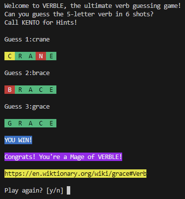

Verble is a command-line version of Wordle that mainly features verbs, with a few nouns thrown in. Here's how you can install and play the game:

## Github actions
- The game is automatically built with Github actions, so you can download it from "releases"

## Installation with PyInstaller
- Install [PyInstaller](https://www.pyinstaller.org/)
- Download the Verble repository as a ZIP file to your local machine, extract it to a folder, and navigate to that folder in your terminal. 
- In your terminal, run the following command(Replace "path/to" with the actual path to the Verble repository):
`pyinstaller --name "Verble" --add-data "path/to/Verble/words;words" --onefile --clean path/to/Verble/src/main.py --icon=path/to/Verble/icon.ico`
- The executable will be created in the `<folder>/dist` folder
- Run the executable to play the game

## Installation from sources
- Clone the repo and install [Miniconda](https://docs.conda.io/en/latest/miniconda.html)
- In your terminal, run the command \
    `conda create --name <env> --file requirements.txt`
- Activate the environment with `conda activate <env>`
- Run the game with `python src/main.py`

## How to play
- You have six attempts to guess a five-letter verb which may have multiple instances of the same letter
- After every guess, each letter is marked as either green, yellow or red
    - Green  : letter is correct and in the correct position
    - Yellow : letter is in the answer but not in the right position
    - Red    : letter is not in the answer at all

## Data
- The "complete" list of verbs is derived from the website of [Ashley Bovan](http://www.ashley-bovan.co.uk/words/partsofspeech.html) 
- The "most frequent" list of verbs is derived from [Google's N-gram corpus](http://storage.googleapis.com/books/ngrams/books/datasetsv2.html).